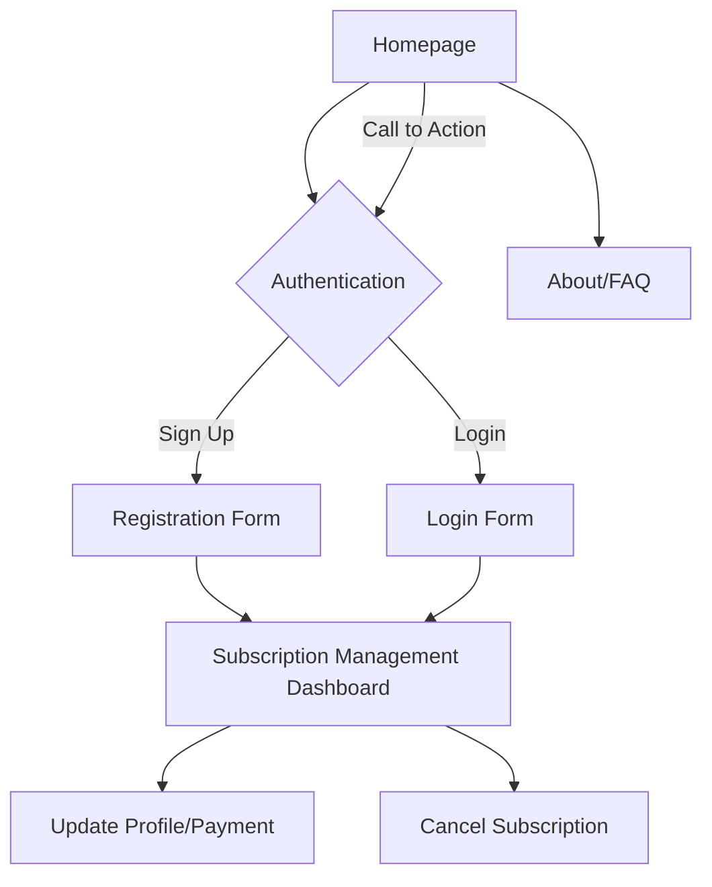

## Document 4: JFeelgood Subscriptions UI/UX Specification

```text
# JFeelgood Subscriptions UI/UX Specification
## Introduction
This document defines the user experience goals, information architecture, user flows, and visual design specifications for the JFeelgood Subscriptions project's user interface. It complements the main JFeelgood Subscriptions Product Requirements Document (PRD).
* **Link to Primary Design Files:** To be created.
* **Link to Deployed Storybook / Design System:** Not applicable at this stage.
## Overall UX Goals & Principles
* **Target User Personas:**
    * Art collectors and enthusiasts.
    * Individuals seeking unique, monthly subscription services.
    * People looking for "feelgood" content to brighten their day or decorate their spaces.
* **Usability Goals:**
    * **Intuitive Navigation:** Users should easily find information about the service and how to subscribe.
    * **Effortless Onboarding:** The sign-up and subscription process should be quick and straightforward, minimizing user friction.
    * **Clear Feedback:** Provide immediate and understandable feedback for user actions, especially during authentication and payment.
* **Design Principles:**
    * **Joyful Simplicity:** The design should be clean, uncluttered, and evoke a positive, "feelgood" emotion.
    * **Consistency:** Maintain a consistent visual style and interaction patterns across all elements of the landing page and subscription management.
    * **Transparency:** Clearly communicate subscription details, pricing, and terms.
    * **Accessibility:** Ensure the design is usable by a broad range of users, considering various abilities.
## Information Architecture (IA)
### Site Map / Screen Inventory


- **Homepage:** The main landing page, serving as the entry point, showcasing the service description, art visuals, subscription details, and Call to Action buttons.

- **Authentication (Sign Up/Login):** This conceptual node represents the forms required for users to create new accounts or log into existing ones.

- **Registration Form:** Specific form for new users to sign up.

- **Login Form:** Specific form for existing users to log in.

- **Subscription Management Dashboard:** A protected area where authenticated subscribers can view their current subscription status.

- **Update Profile/Payment:** Functionality within the dashboard for users to update personal or payment information.

- **Cancel Subscription:** Functionality within the dashboard allowing users to cancel their subscription.

- **About/FAQ:** An optional section for more detailed information about the service, art, and frequently asked questions.

### Navigation Structure

The primary navigation will be driven by clear Call to Action buttons on the Homepage leading to the Authentication forms ("Subscribe Now", "Learn More"). Once authenticated, a user will be redirected to their Subscription Management Dashboard. Navigation within the dashboard will allow users to access various management functionalities. An "About/FAQ" link might be present on the homepage for detailed information.

## User Flows

### User Login/Sign Up Flow

- **Goal:** For a new or returning user to gain access to their subscription management.

- **Steps / Diagram:**

Code snippet

```text
graph TD
    A[Homepage] --> B{Click Subscribe Now / Login};
    B -- New User --> C[Registration Form];
    B -- Existing User --> D[Login Form];
    C --> E[Complete Registration];
    D --> F[Submit Login Credentials];
    E --> G[Subscription Management Dashboard];
    F --> G;
    G -- If Not Subscribed --> H[Payment Information Form];
    H --> I[Subscription Confirmed];
```

### Initial Subscription Process

- **Goal:** For a new user to successfully subscribe to the monthly art print service.

- **Steps / Diagram:**

Code snippet

```text
graph TD
    A[Homepage] --> B[Click Subscribe Now];
    B --> C[Registration/Login Form];
    C -- New User Flow (as above) --> D[Payment Information Form];
    D --> E[Enter Payment Details];
    E --> F[Submit Payment];
    F -- Success --> G[Subscription Confirmed & Access Dashboard];
    F -- Failure --> H[Show Error Message & Retry Payment];
```

## Wireframes & Mockups

This section references the external design files where detailed visual designs and interactive prototypes will be maintained. No files currently exist, and their creation will be handled in a dedicated design phase using tools like Figma, Sketch, or Adobe XD.

- **Screen / View Name 1: Homepage**

    - **Description:** Primary landing page showcasing the service with engaging visuals and clear calls to action.

    - **Link to specific Figma frame/page:** To be created.

- **Screen / View Name 2: Sign Up/Login Forms**

    - **Description:** Dedicated views for user registration and existing user login, ensuring a clear and secure process.

    - **Link to specific Figma frame/page:** To be created.

- **Screen / View Name 3: Subscription Management Dashboard**

    - **Description:** A personalized view for logged-in subscribers to manage their account, view subscription status, and update details.

    - **Link to specific Figma frame/page:** To be created.

## Component Library / Design System Reference

- **Approach:** For this MVP, we will establish a foundational component library. This will allow for consistent design and development of reusable UI elements. As the project grows, this can evolve into a more comprehensive design system.

- **Initial Foundational Components (High-Level):**

    - **Buttons:** Various states (primary, secondary, disabled, loading) and sizes.

    - **Input Fields:** Text, password, email inputs with validation states.

    - **Forms:** Standardized structure for sign-up, login, and payment forms.

    - **Cards:** Used for displaying art prints and subscription details.

    - **Typography Elements:** Consistent headings, body text, and links.

    - **Icons:** Small, illustrative graphics for actions or information.

## Branding & Style Guide Reference

This section outlines the foundational visual elements to ensure a cohesive and "feelgood" brand experience. Detailed design specifications will be elaborated in external design files.

- **Color Palette:**

    - **Primary:** A vibrant, uplifting color (e.g., a warm yellow or bright teal).

    - **Secondary:** A complementary, calming color (e.g., a soft blue or light green).

    - **Accent:** A contrasting, attention-grabbing color for CTAs (e.g., an energetic orange or deep purple).

    - **Neutrals:** Soft grays and whites and whites for backgrounds and text, ensuring readability.

- **Typography:**

    - **Font Families:** A clean, legible sans-serif font for body text, potentially paired with a friendly, slightly more decorative font for headlines to convey the "feelgood" theme.

    - **Sizes & Weights:** Defined hierarchy for headings (H1, H2, H3), body text, and captions to ensure visual order and readability.

- **Iconography:**

    - **Style:** Simple, line-based or filled icons that align with the overall "feelgood" and clean aesthetic.

    - **Usage Notes:** Icons to be used for clear visual communication without clutter.

- **Spacing & Grid:**

    - **System:** A consistent 4-point or 8-point grid system to ensure harmonious spacing and alignment across all elements.

    - **Margins & Padding:** Defined spacing rules to provide adequate white space and visual breathing room.

## Accessibility (AX) Requirements

- **Target Compliance:** WCAG 2.1 AA.

- **Specific Requirements:**

    - **Keyboard Navigation:** All interactive elements (buttons, links, form fields) must be fully navigable and operable using only the keyboard. Focus order should be logical and intuitive.

    - **ARIA Landmarks/Attributes:** Appropriate ARIA roles, states, and properties should be used for complex components (e.g., forms, navigation) to convey meaning to assistive technologies.

    - **Color Contrast:** All text and essential UI elements must meet WCAG 2.1 AA contrast ratios to ensure readability for users with visual impairments.

    - **Alternative Text:** All meaningful images must have descriptive `alt` text.

    - **Form Labels:** All form fields must have explicit, programmatically associated labels.

## Responsiveness

The JFeelgood Subscriptions landing page and subscription management interface will be designed to provide an optimal viewing and interaction experience across a wide range of devices, from mobile phones to desktop monitors.

- **Breakpoints:**

    - **Mobile:** Up to 640px (e.g., small smartphones)

    - **Tablet:** 641px - 1024px (e.g., larger smartphones, tablets in portrait)

    - **Desktop:** 1025px and up (e.g., tablets in landscape, laptops, desktops)

- **Adaptation Strategy:**

    - **Fluid Grids:** Layouts will utilize flexible grids that resize proportionally to the screen width.

    - **Flexible Images:** Images and media will scale appropriately to fit their containers, preventing overflow.

    - **Media Queries:** CSS media queries will be used to apply different styles, layouts, and component visibility rules based on the defined breakpoints.

    - **Content Prioritization:** On smaller screens, content will be prioritized, and less critical elements may be hidden or presented differently (e.g., navigation becoming a hamburger menu).

    - **Touch-Friendly Interactions:** Ensure all interactive elements (buttons, forms) are appropriately sized and spaced for touch input on mobile devices.

